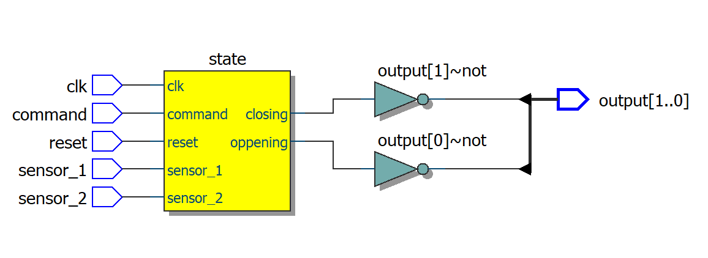
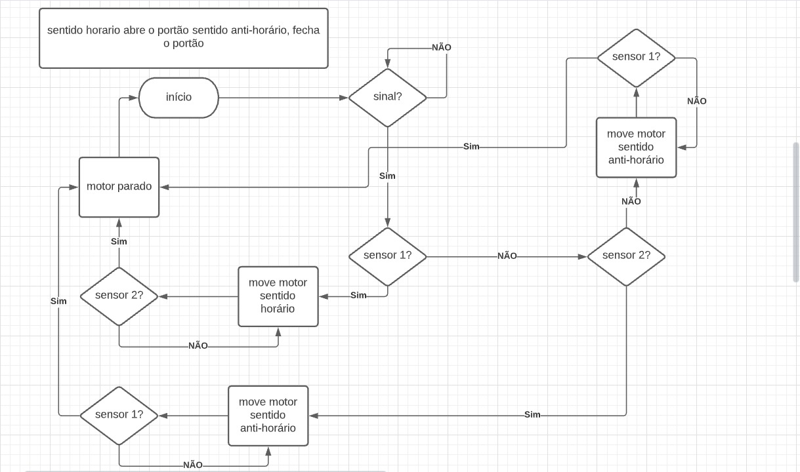

# Controlador de Portao em um FPGA

Implementação de um controlador de motor de portão de garagem utilizando a palataforma Altera cyclone 5 via dev board DE0-CV.

## Equipe:

- Daniel Duplat;
- Rafael Bessa;
- Pedro Marcelo;
- Lucas Ortega.

## Diagrama RTL

## Fluxograma

